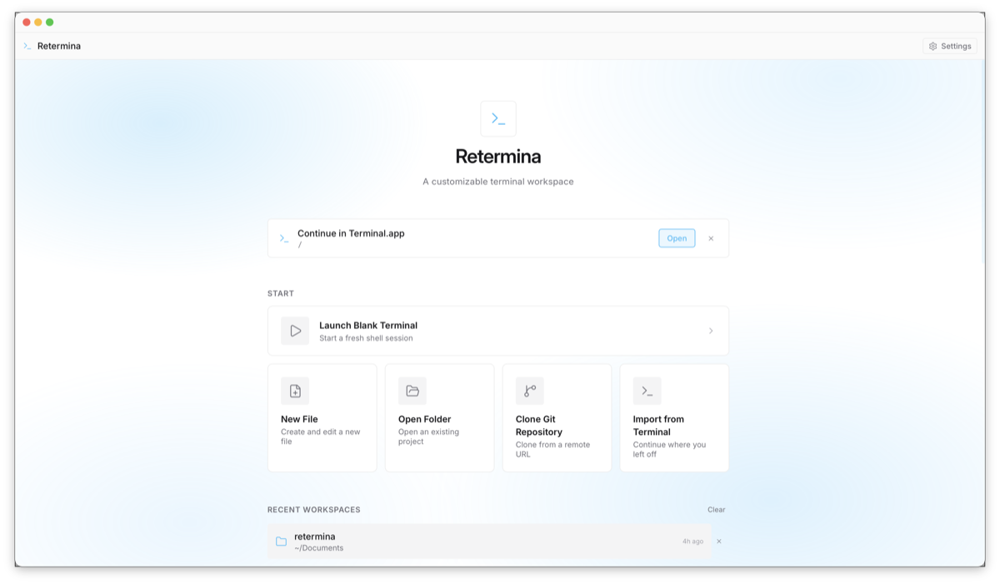

# Retermina

A high-utility terminal workspace built on Tauri v2 and React. Retermina replaces the traditional terminal window with a modular, themeable developer environment that runs your native shell securely inside a Rust PTY — with no cloud dependency, no token limits, and no subscription.



---

## Installation (macOS)

After mounting the `.dmg` and dragging Retermina to Applications, macOS may show **"Retermina is damaged and can't be opened"**. This is a Gatekeeper quarantine flag — not actual corruption. Fix it by running:

```sh
xattr -cr /Applications/Retermina.app
```

Then open the app normally.

---

## Architecture

### Tauri v2 + Rust backend

Retermina is a native desktop application built with [Tauri v2](https://v2.tauri.app). The Rust backend owns all privileged operations:

- **PTY management** — spawns and drives native shell sessions (Zsh, Bash) via `portable-pty`. Output is base64-encoded and streamed to the frontend over a Tauri `Channel` for zero-copy delivery to xterm.js. Each session is launched with `TERM=xterm-256color`, `COLORTERM=truecolor`, and a theme-derived `COLORFGBG` (light vs. dark) so CLI tools like the Claude CLI pick a foreground that stays legible on light themes instead of assuming a dark background.
- **Editor history** (`vscode.rs`) — `get_recent_workspaces` reads the local VSCode/Cursor/VSCodium `state.vscdb` (read-only) to surface recently opened folders on the Launch Hub alongside Retermina's own history.
- **File system** — `list_dir`, `read_file`, `write_file`, `create_file`, `create_dir`, `rename_path`, `delete_path` commands with a 5 MB read cap and UTF-8 validation, plus `suggest_directories` / `validate_directory` backing the Launch Hub's autocompleting "Open Folder" field and `list_files` (a capped recursive walk) powering the Cmd/Ctrl+P quick-open index.
- **Font storage** (`fonts.rs`) — `save_font` / `read_font` / `list_fonts` / `delete_font` copy uploaded `.ttf`/`.otf` files into `<data_dir>/Retermina/fonts` (path-traversal-safe, extension-validated) and stream their bytes back as base64 for `FontFace` registration.
- **Claude integration** (`claude_stats.rs`) — `get_claude_token_usage` parses the local Claude CLI JSONL logs for the open project to compute per-project token totals and an estimated cost. `set_claude_theme` keeps Claude Code's own UI theme in step with the active engine by surgically updating the `theme` key in `~/.claude.json` (read-modify-write of that one key, atomic temp-file rename, and it never creates the file).
- **Loom presets** (`presets.rs`) — `read_presets` / `write_presets` persist the preset library to `<data_dir>/Retermina/presets.json`, serving as the Tauri-file storage backend for the Loom store.
- **Git context** — shells out to `git status --porcelain=v2` to supply live repo metadata (branch, short HEAD commit from the `# branch.oid` line, ahead/behind counts, staged/unstaged file counts) to the Iris command bar.
- **Port discovery** — `lsof` / `netstat` parsing to surface active local servers in the Localhost Tracker panel.

IPC uses Tauri's typed `invoke` for request/response and `Channel<T>` for streaming PTY output. The `updater` + `process` plugins back the Settings → Version self-update flow, and the `dialog` plugin powers Loom export/import file pickers. All window actions (drag, close, destroy, minimize, maximize, animated resize) and plugin permissions are explicitly granted via `capabilities/default.json` — nothing is implicitly allowed. (`allow-destroy` is what lets the Preview pop-out actually tear itself down on close.)

### Workspace grid — powered by react-grid-layout

The panel workspace is driven by **[react-grid-layout](https://github.com/react-grid-layout/react-grid-layout)**, the open-source draggable and resizable grid layout library. Retermina uses its v2 API with the following configuration:

- **Fully controlled layout** — all panel coordinates live in a Zustand store and round-trip through `onLayoutChange`. The grid never owns state.
- **`noCompactor`** — panels remain static between explicit user actions. No automatic reflow.
- **12 × 10 grid** — 12 columns, 10 rows, with row height derived dynamically so the grid fills the available window height at any window size.
- **8-direction resize** — `n`, `ne`, `nw`, `s`, `se`, `sw`, `e`, `w` handles.
- **Collision resolution** — on drop, displaced panels are resolved via resize → swap → abort, using a pre-drag layout snapshot so the correct panel is identified regardless of RGL's internal collision pass.

Panel children are memoized against `[panels, cwd, closePanel]` so live terminal sessions survive drag and resize without remounting.

---

## Features

### Modular panel workspace

Eight panel types can be independently toggled, dragged, resized, and arranged across the 12-column grid:

| Panel | Purpose |
|---|---|
| **Explorer** | Directory tree with expand/collapse navigation, inline create/rename/delete, and a right-click context menu |
| **Terminal** | Live xterm.js shell connected to a native PTY — splittable into independent panes (H / V) from a top toolbar, each with its own PTY, with a **broadcast** toggle that mirrors input to every pane. Supports scrollback search (**Cmd/Ctrl+F**) and clickable links (open in the default browser) |
| **Code** | File viewer with syntax highlighting, live diff, and inline hex colour swatches — plus a Safe Edit mode that keeps full highlighting while you type and adds in-file find & replace (**Cmd/Ctrl+F**) |
| **Localhost** | Active port tracker with one-click process termination |
| **Claude Code** | Dedicated terminal that auto-launches the `claude` CLI, with a per-project token-usage strip. Its UI theme tracks the active engine (see [Semantic theming](#semantic-theming-engine)), and a dismissible prompt offers to restart the session when a light↔dark switch needs it |
| **Preview** | Live preview launcher — opens a standalone native window pointed at a dev-server URL |
| **Changes** | Live project-wide git diff (working tree vs `HEAD`) that updates as files change — including edits made by the Claude CLI in the Terminal — with a commit composer (message + "Commit all") and per-file discard |
| **Tasks** | Auto-detected runnable scripts — `package.json` (npm/pnpm/yarn/bun), `Makefile` targets, and Cargo — each a one-click button that runs in the active terminal |

Panels snap to the grid, resize from all eight edges, and resolve collisions without flying off-screen.

#### Workspace tabs

Open several workspaces at once — each tab keeps its own folder, panel layout, and **live terminals**. Every tab stays mounted (inactive ones are hidden with `visibility`, not unmounted), so a backgrounded tab's PTYs keep running and its grid stays correctly sized. Tabs can be **dragged to reorder** and **middle-clicked to close**, the strip fades at the edges when it overflows, and `⌘T` / `⌘W` / `⌘1–9` / `⌘⇧[` `⌘⇧]` drive them from the keyboard.

#### Panel focus mode

Double-click any panel's header (or its maximize button) to blow that panel up to fill the whole grid; **Esc** or the restore button drops it back. All panels stay mounted underneath, so live shells survive — it's purely a CSS overlay over the same grid, not a remount.

#### Undo & toasts

Destructive grid actions surface a corner toast with **Undo** — resetting a layout or closing a tab can be reverted in one click before the toast dismisses.

#### Terminal search & clickable links

Each terminal loads xterm's **search** and **web-links** addons. **Cmd/Ctrl+F** opens an in-panel find bar with next/previous navigation (Enter / Shift+Enter), a live match counter, and incremental highlighting as you type; **Esc** dismisses it. URLs in terminal output are clickable and open in the OS default browser through the Tauri opener plugin (not xterm's default `window.open`, which the webview blocks). Both apply to every terminal — split panes and the Claude Code panel included.

#### Syntax highlighting

The read-only Code view is tokenized with **Prism** and rendered to React nodes (not an HTML string), so highlighting and the hex-colour swatches coexist — every plain-text token is still scanned for colour literals. Token colours are driven by per-engine `--rt-syn-*` CSS variables, so the highlighting re-themes with the app and stays legible on both light and dark engines. Language is resolved from the file extension (TS/TSX, JS/JSX, JSON, CSS, HTML, Markdown, Bash, Python, Rust, YAML, TOML); unknown types or very large files fall back to plain text + swatches.

Highlighting no longer stops when you unlock the file: **Safe Edit** layers a transparent-text `<textarea>` over the highlighted `<pre>` (scroll-synced, matched font metrics), so full syntax colour survives as you type instead of dropping to a plain textarea. Edit mode also gets **in-file find & replace** (**Cmd/Ctrl+F**): next/previous navigation with a live match counter, replace one or replace all — case-insensitive literal matching over the edit draft.

Markdown files (`.md` / `.markdown` / `.mdx`) additionally get a **rendered preview** — default on, with a one-click Preview/Source toggle. The renderer (`lib/markdown.tsx`) is a dependency-free subset that outputs React nodes (never an HTML string) and restricts link schemes, so file content can't inject markup.

#### Inline colour swatches

The Code viewer scans file contents for CSS hex colour literals (`#rgb`, `#rgba`, `#rrggbb`, `#rrggbbaa`) and renders a small colour chip immediately before each value, the way VS Code does. Decoration is skipped above 200 KB so large files stay responsive.

#### Quick-open (Cmd / Ctrl + P)

A fuzzy file finder indexes the active workspace via the Rust `list_files` command (a capped, depth-first walk that skips `node_modules`, `.git`, build output, and hidden entries). Matches are scored with a basename-weighted fuzzy ranker; pressing Enter opens the file in the Code panel, revealing the panel if it was hidden. It mirrors the **Cmd / Ctrl + K** Command Palette's overlay and keyboard navigation.

#### Content search (Cmd / Ctrl + Shift + F)

Where quick-open matches file *names*, content search matches file *contents*. The Rust `search_in_files` command runs a plain-substring search over the same depth-first walk (reusing the quick-open ignore rules), skipping binary files and anything over 2 MB and stopping once a result cap is hit so large trees never hang — no external `ripgrep`/`grep` dependency. The overlay debounces as you type, groups matches by file with per-line numbers and an inline highlight of the hit, and is fully keyboard-navigable; choosing a match opens the file in the Code panel **scrolled to that line** (the read-only view's non-wrapping `<pre>` makes a line-height offset land exactly), revealing the panel if it was hidden.

#### Floating menus

Right-click menus and popovers render through a portal into `document.body` (`FloatingMenu`). Because react-grid-layout applies a `transform` to each panel, a normal `position: fixed` menu would be trapped and clipped by the panel's `overflow: hidden`; the portal lifts menus onto the top layer above every panel and clamps them to stay fully on-screen.

### Iris command bar

Iris is a **local, tokenless** command bar at the bottom of the workspace. It requires no API keys, no network connection, and no LLM inference.

The bar doubles as a **git status strip**: inside a repo it shows the current branch, the short **HEAD commit** (`@abc1234`), ahead/behind counts, and an uncommitted-changes dot — all parsed from the single `git status --porcelain=v2` call that also gates the macros, so the commit display costs no extra git invocation.

**Custom macros.** Beyond the built-in catalog below, you can add your **own** macros — a name, match keywords, and a command line — from the manager on the Iris bar. They're persisted locally and merged into the suggestion ranking (always available, run as typed), so your repeated workflows become one fuzzy match away.

**How it works:**
- A static macro catalog is filtered at query time against `IrisCtx` — a context object that merges live Git state (branch, ahead/behind counts, staged/unstaged file counts) with the currently open file path.
- **Fuzzy matching** scores each macro's title and keywords: prefix match → 100 pts, substring → 60 pts, subsequence → 25 pts. Macros scoring 0 are excluded.
- **Contextual gating** — every macro declares `available(ctx): boolean`. "Push" only surfaces when commits are ahead of upstream. "Diff staged" only appears when staged changes exist. File commands only appear when a file is open in the Code panel.
- A **"Run as typed"** fallback always appears for non-empty queries so any raw shell command is one Enter away.
- **Navigation:** `↑ ↓` to move through suggestions, `Enter` or `Tab` to run, `Esc` to dismiss.

#### Git commands

| Keywords | Command | When available |
|---|---|---|
| `sync`, `rebase`, `update` | `git pull --rebase && git push` | repo, has upstream, ahead or behind |
| `push`, `upload`, `publish` | `git push` | repo, has upstream, commits ahead |
| `publish`, `set upstream` | `git push -u origin <branch>` | repo, no upstream set |
| `pull`, `download`, `merge` | `git pull` | repo, has upstream, commits behind |
| `fetch`, `prune` | `git fetch --all --prune` | in any repo |
| `commit`, `commit all`, `ci` | `git add -A && git commit` | repo, uncommitted changes |
| `commit staged`, `ci` | `git commit` | repo, staged changes exist |
| `stage`, `add`, `git add` | `git add -A` | repo, unstaged or untracked files |
| `checkout`, `switch`, `change branch` | `git checkout <branch>` *(prompts for name)* | in any repo |
| `new branch`, `create branch`, `feature branch` | `git checkout -b <branch>` *(prompts for name)* | in any repo |
| `merge`, `combine branch` | `git merge <branch>` *(prompts for name)* | in any repo |
| `tag`, `create tag`, `release` | `git tag <name>` *(prompts for name)* | in any repo |
| `status`, `st`, `what changed` | `git status` | in any repo |
| `diff`, `changes`, `delta` | `git diff` | repo, unstaged changes |
| `diff staged`, `cached` | `git diff --staged` | repo, staged changes exist |
| `log`, `history`, `graph` | `git log --oneline --graph --decorate -20` | in any repo |
| `stash`, `shelve` | `git stash push -u` | repo, uncommitted changes |
| `stash pop`, `unstash`, `pop` | `git stash pop` | in any repo |
| `stash list`, `stashes` | `git stash list` | in any repo |
| `branch`, `branches` | `git branch -a` | in any repo |
| `remote`, `remotes`, `origin` | `git remote -v` | in any repo |
| `init`, `new repo` | `git init` | **not** in a repo |
| `discard`, `restore` *(hidden)* | `git restore .` | repo, unstaged changes |
| `undo`, `undo commit` *(hidden)* | `git reset --soft HEAD~1` | in any repo |
| `amend`, `fix commit` *(hidden)* | `git commit --amend --no-edit` | in any repo |

> Hidden commands only appear when explicitly typed — they never show in the default empty-query list.

#### npm commands

| Keywords | Command |
|---|---|
| `install`, `npm i`, `dependencies` | `npm install` |
| `dev`, `start`, `serve`, `vite` | `npm run dev` |
| `build`, `bundle`, `compile` | `npm run build` |
| `test`, `jest`, `vitest`, `spec` | `npm test` |
| `lint`, `eslint`, `check` | `npm run lint` |
| `run`, `npm run`, `script` | `npm run <script>` *(prompts for script name)* |

#### Shell commands

| Keywords | Command |
|---|---|
| `ls`, `list`, `dir`, `files` | `ls -la` |
| `clear`, `cls` | `clear` |
| `pwd`, `where`, `cwd` | `pwd` |
| `du`, `disk`, `size`, `folder size` | `du -sh ./* \| sort -h` |
| `find`, `typescript`, `javascript`, `source` | `find` for all TS/JS/TSX/JSX, excluding `node_modules` and `dist` |
| `ps`, `processes`, `node`, `running` | `ps aux` filtered for node/npm/vite/pnpm |
| `mkdir`, `make dir`, `new folder` | `mkdir -p <name>` *(prompts for directory name)* |

#### File commands *(require a file open in the Code panel)*

| Keywords | Command |
|---|---|
| `finder`, `reveal`, `locate` | `open -R "<path>"` — opens Finder with file selected |
| `open`, `open file`, `default app` | `open "<path>"` — opens with default macOS application |
| `copy path`, `clipboard`, `path` | `echo -n "<path>" \| pbcopy` — copies path to clipboard |

### Semantic theming engine

Five structural theme engines swap the entire visual character of the application via a single `data-theme` attribute on `<html>`. No React re-render is triggered — the attribute change is handled entirely in CSS.

| Engine | Character |
|---|---|
| **Sleek** | Dark surfaces, emerald accent, sharp corners |
| **Soft Pastel** | Light, generous rounding, per-surface blur, violet accent |
| **Transparent Glass** | Frosted panels over a blurred, semi-transparent window background |
| **Minimalist** | Flat, hairline borders, near-monochrome |
| **Neo-Brutalism** | 2px black borders, hard offset shadows, green accent, zero radius |

Each engine defines ~50 CSS custom properties (`--rt-bg`, `--rt-surface`, `--rt-accent`, `--rt-backdrop`, `--rt-shadow-panel`, etc.). Components use semantic utility classes (`.rt-panel`, `.rt-btn`, `.rt-menu`) that read the tokens — no per-component theme logic.

The xterm.js terminal color table is also engine-specific. Only the **cursor** and **selection** track the active accent — the selection is painted as a solid accent fill so a highlight inside the Terminal reads identically to the web `::selection` highlight in the Code panel. The ANSI palette slots (`red`, `blue`, `green`, …) are left as each engine's own values, which doubles as a palette terminal apps can inherit. For tools that auto-detect light/dark from the environment, each shell is spawned with a theme-derived `COLORFGBG`, so they choose a foreground that stays readable on light engines rather than emitting near-invisible white text. (This is read once at shell start, so it applies to sessions spawned after a theme switch.)

Selection (and other content drawn _on_ the accent — checkmarks, radio dots, the toggle knob) uses a **contrast-aware foreground**: ThemeProvider computes a `--rt-accent-contrast` token from the accent's WCAG luminance and picks near-black or white, whichever reads better. So a light custom accent (e.g. white) no longer turns highlights into blank, unreadable blocks.

**Claude Code theme sync.** The Claude Code panel embeds the real `claude` CLI, which reads its own UI theme from `~/.claude.json` — so Retermina keeps that theme aligned with the active engine: a light engine maps Claude to `light-ansi`, a dark engine to `dark-ansi`. The `*-ansi` variants make Claude paint with the engine's own 16-colour ANSI palette rather than its stock colours, so it blends into each theme. Claude reads the theme at launch, so a running session keeps the look it started with; when a light↔dark switch leaves it out of step, the panel shows a small, dismissible prompt offering to restart the session — you decide when, so a cosmetic change never drops a conversation. (Same-brightness switches — e.g. Soft Pastel → Minimalist, both light — map to the same variant and never prompt.)

**Soft Pastel** additionally derives much of its surface palette from the live accent via `color-mix` — the base tint, ambient radial glows, hover wash, borders, panel glow, focus ring, and terminal tint all track the chosen accent — so picking a new accent re-tints the whole workspace, not just the backdrop.

### Customization & the Settings overlay

A centred, frosted-glass **Settings overlay** centralizes all customization behind one gear button (available from both the Launch Hub and the workspace toolbar). It is organized into seven tabs — **Theme**, **Appearance**, **Loom**, **Accessibility**, **Font**, **Shortcuts**, and **Version** — and every change is written straight to the persisted Zustand store (mirrored to `settings.json`), so it survives restarts:

- **Theme** — visual preview cards for the five engines, an accent-colour picker (presets + custom hex/colour input), "Save as preset", and a one-click revert to the engine's brand accent. Preview cards paint in their own palette, so a dark card keeps light text (and vice-versa) regardless of the active theme. A **Font pairing** control suggests (and optionally auto-applies) the font categorized for the active theme.
- **Appearance** — top-bar style (icons only vs. icons + labels), panel-toggle style (dropdown vs. icon strip), a global **workspace text scale** slider (80–130 %) that drives the root `font-size`, and a **workspace backdrop** selector: Solid, an accent-tinted **Gradient**, a **Mesh** of accent blobs, or a fully **Custom** gradient built in an in-app editor (linear/radial, angle, add/remove colour stops, live preview) — layered over whichever engine is active.
- **Loom** — the preset library (see [Retermina Loom](#retermina-loom--portable-preset-system)): a grid of live-rendered preview tiles with apply / export / delete / import, and **Browse community Looms** (the gallery).
- **Accessibility** — a **Motion** policy (follow the OS "Reduce Motion" setting, force motion on, or force reduced — honoured in CSS *and* the window animations), plus **Increase contrast** (stronger borders + text on every engine), **Reduce transparency** (drop the frosted blur), and a **terminal cursor blink** toggle.
- **Font** — a dedicated **Terminal** typeface + size control (a monospace picker plus a size that applies live to every terminal, independent of the UI font) and the UI-font picker: bundled typefaces (Inter, Space Grotesk, Nunito, JetBrains Mono) or **upload your own** `.ttf`/`.otf`, grouped by thematic category. Uploaded files are copied by Rust into `<data_dir>/Retermina/fonts` and registered at runtime with the `FontFace` Web API (bytes flow through Rust as base64, so no `asset://` scope is needed).
- **Shortcuts** — every global command's keybinding, **fully rebindable**: click a shortcut, press a new chord, done. Bindings are kept unique (assigning one already in use clears it from the other command), and **⌘/** opens a read-only cheat-sheet of the full list. Defaults cover the command palette (⌘K), file (⌘P) and content (⌘⇧F) search, new / close / next / previous tab, and opening settings — and **⌘1–9** jump straight to a tab.
- **Version** — shows the current app version and a **Check for Updates** button that drives the `@tauri-apps/plugin-updater` flow (download with progress → relaunch via `@tauri-apps/plugin-process`). Retermina also checks for updates **on launch** (silently — a failed/unreachable endpoint is a no-op) and surfaces an available update through a dismissible banner; the manual button and the banner share one updater store, and a dismissal is remembered per version so the same update won't nag again.

### Retermina Loom — portable preset system

A **Loom** is a single JSON document that bundles a complete app configuration — both halves of the experience:

- **Cosmetic** — theme engine, accent colour, top-bar/toolbar style, the UI **and terminal** fonts (+ terminal size), global text scale, the **workspace backdrop** (including a custom gradient), and the **accessibility** preferences (motion, contrast, transparency, cursor blink).
- **Structural** — the full react-grid-layout topology (coordinates + sizes), the panels it hosts, and per-panel text-zoom overrides.

The dedicated **Loom** tab renders your saved Looms as a grid of **live preview tiles** (each drawn from the Loom's own theme — no screenshots) and lets you name and **Save** the current setup, **Apply** any saved Loom (the theme re-skins and the grid re-mounts in real time), **Delete**, **Export** / **Import from Loom**, and **Share** to the community gallery:

- **Persistence** — the library is stored as `presets.json` under the app data directory via the Rust `read_presets` / `write_presets` commands (a Tauri-file-backed Zustand storage), independent of localStorage.
- **Export / Import** — uses Tauri's `dialog.save` / `dialog.open` plugin to write/read a shareable `.json` file. An exported Loom can embed the bytes of a referenced custom font, so on import the typeface is reinstalled automatically and the preset's font resolves on another machine.
- **Graceful fallback** — every load runs through a schema validator (`parsePreset`); corrupt or partial layout data degrades to the default grid instead of crashing the window.
- **Privacy** — a Loom captures _only_ layout geometry + panel identity and cosmetic settings. It never serializes live-session state: no PTY/terminal buffers, no working directory, no open-file paths or contents. Presets stay local by default; nothing is ever uploaded automatically or in the background — sharing to the community gallery is **explicit and opt-in** (see below).

> The toolbar **Presets** menu is a separate, lighter-weight store for **layout-only** snapshots (panels + grid, no theme), kept in localStorage. Looms are the full theme + layout bundles managed from the Loom tab. Applying either one sets the **layout template** for the workspace, so newly opened tabs inherit the arrangement instead of resetting to the default grid.

#### Community gallery

**Browse community Looms** (Settings → Loom → Browse) fetches a published `catalog.json` and renders each shared Loom as a live preview tile; **Install** fetches it, runs it through the same `parsePreset` validator, and applies it. **Sharing is explicit**: the **Share** action opens a pre-filled GitHub issue in the [`retermina-looms`](https://github.com/matthewhamilton3141/retermina-looms) repo — an automated check validates the Loom (strict schema: hex-only colours, enum/range checks, no bundled font binaries) and opens a pull request, and a maintainer merge publishes it. That human merge is the moderation gate, so nothing reaches the gallery unreviewed. The website's gallery reads the **same catalog**, so the app and the site always show the identical set.

### Live file diff viewer

The Code panel includes a built-in diff mode. When activated:
1. A baseline snapshot of the current file content is captured.
2. The file is polled every 1.5 seconds via the Rust `read_file` command.
3. Changes are computed in-browser using a pure-TypeScript **LCS (Longest Common Subsequence)** diff algorithm — no external diff packages.
4. The result renders as a git-diff-style view: green additions, red deletions, collapsed unchanged context.

The diff panel also supports **Safe Edit** mode — an editable overlay backed by the Rust `write_file` command that keeps Prism syntax highlighting while you type and includes in-file find & replace (see [Syntax highlighting](#syntax-highlighting)).

### Changes panel — live git diff

Where the Code panel's diff tracks a single open file against a manual snapshot, the **Changes** panel shows the whole working tree. It polls `git` (via the `run_background_command` bridge — no new native commands) every couple of seconds and renders a per-file, collapsible diff of everything changed since the last commit:

- **Tracked edits** come from `git diff HEAD`; **new untracked files** are read directly and rendered as all-additions (git omits them from the diff until staged).
- Files carry a status badge (M/A/D/R/U) and per-file `+/−` counts, with green/red line rendering and `@@` hunk headers.
- Because it just polls git, it reflects edits from **anywhere** — most usefully, changes the Claude CLI makes while running in the Terminal show up here live.

It's also **actionable**: a commit composer (message + **Commit all** → `git add -A && git commit`) and a per-file **discard** (`git checkout` / `git clean` for untracked, with a confirm) run through the same `run_background_command` bridge — no new native commands — and refresh the diff on success.

### Live preview window

The **Preview** panel launches a standalone native window (not a sandboxed iframe), so dev-server HMR WebSockets connect directly. Detected localhost ports are offered as one-click targets. Closing the window (its native button, the panel's Close, or the title-bar indicator) tears the preview down deterministically and — unless you turn off **"Stop the dev server when closing"** — kills the dev server bound to that port. A guard refuses to kill Retermina's *own* dev server if you happen to preview it.

### Launch Hub actions

The Launch Hub offers four workspace-entry actions alongside recent and editor workspaces:

| Action | Behaviour |
|---|---|
| **Open Folder** | Autocompleting path field — opens a directory as a workspace |
| **New File** | Create a new file at an absolute path and open it in the Code panel |
| **Clone Repo** | Runs `git clone <url>` in a background terminal, then opens the result |
| **Import from Terminal** | Detects the current working directory of your active external terminal (Terminal.app, iTerm2, Warp, Ghostty, or any shell) via `lsof` + AppleScript — no commands run inside your shell. On focus, Retermina silently polls for an open terminal session and surfaces a one-click banner to open that path as a workspace. |

### OS drag-and-drop

- **LaunchHub** — drag a folder from Finder to open it as a workspace; drag a text file to open it in the Code panel.
- **Terminal panels** — drag files or folders onto any terminal to paste their shell-quoted paths at the cursor, without an implicit newline.

### Recent workspaces

Every folder opened in Retermina is recorded in a native localStorage history (max 20 entries, timestamped). The LaunchHub displays them sorted by recency with relative timestamps and per-entry removal. It also surfaces recent folders from your local editor history (VSCode / Cursor / VSCodium, via the Rust `get_recent_workspaces` command), merged in and de-duplicated against Retermina's own list — local entries win, and editor-sourced folders are tagged **Editor**. Opening one records it into the local history, so it stops showing as a duplicate next time.

### Session restore

On launch Retermina reconnects to where you left off: the last workspace folder, the panel layout, and the file that was open in the Code panel (reopened by path). The panel layout (geometry + which panels are visible, with per-panel zoom) is persisted by the workspace-layout store; the cwd and the open file are persisted by a small session store. Layouts also persist **per folder**: closing a workspace snapshots its arrangement by cwd (the 30 most recent folders are kept), so reopening that project restores it exactly — applying a Loom clears these snapshots so a fresh preset takes effect everywhere. Restore is local-only and privacy-preserving in the same spirit as a Loom — it records **paths and layout, never contents**: no file bodies, no PTY/terminal scrollback, no shell history. Navigating back to the Launch Hub clears the session, so a deliberate exit lands you on the hub next launch rather than re-entering the workspace; and a remembered file from one workspace never leaks into another (the open-file pointer resets when the cwd changes).

### Custom title bar

`decorations: false` + `transparent: true` + `macOSPrivateApi: true` gives Retermina full control of the window chrome. A custom title bar renders macOS traffic light buttons and handles window dragging via an explicit `onMouseDown → appWindow.startDragging()` call — not `data-tauri-drag-region`, which would intercept mid-panel-drag mousemove events and break the grid.

**Double-click to maximize** is animated rather than an instant snap: instead of the OS's immediate toggle, the title bar tweens the window's outer bounds (with `requestAnimationFrame` + an `easeOutCubic` curve) between the restored rect and the monitor's `workArea` — so maximize/restore eases smoothly and still respects the dock/menu bar. It honours the **Accessibility → Motion** preference — which follows or overrides the OS `prefers-reduced-motion` setting — with an instant jump when motion is reduced, and falls back to the native toggle if the monitor can't be resolved.

---

## Download

**macOS (universal — Apple Silicon + Intel):** grab the latest `.dmg` from the [**releases page**](https://github.com/matthewhamilton3141/Retermina/releases/latest).

After downloading, drag Retermina to your Applications folder, then run this once in Terminal:

```bash
xattr -dr com.apple.quarantine /Applications/retermina.app
```

macOS flags unsigned apps as damaged — this removes that quarantine attribute. The app itself is unmodified.

---

## Getting Started

**Prerequisites:** Rust toolchain, Node.js ≥ 20, and the macOS build tools.

- macOS: `xcode-select --install`

```bash
git clone https://github.com/matthewhamilton3141/retermina.git
cd retermina
npm install
npm run tauri dev    # development
npm run tauri build  # production bundle
npm test             # run the unit suite (Vitest)
```

The pure logic modules under `src/lib` (the LCS diff, the Iris suggestion ranker, the Loom schema validator, the theme/contrast helpers, and the grid layout reconciler) are covered by a [Vitest](https://vitest.dev) suite — `npm test` runs it once, `npm run test:watch` re-runs on change.

The production build splits heavy vendor libraries (xterm.js, react-grid-layout, Prism) into their own Rollup chunks via `manualChunks` in `vite.config.ts`, so the Launch Hub no longer ships the terminal/grid/highlighter code up front.

> **Self-updates:** the built binary ships without Apple code signing, so the Tauri auto-updater is non-functional — Tauri requires signed builds to verify update integrity. The update check on launch is silent (`silent: true`) and fails gracefully. To get updates, re-download from the [releases page](https://github.com/matthewhamilton3141/Retermina/releases). Auto-update can be enabled later by obtaining an Apple Developer certificate, signing the build, and pointing `plugins.updater.endpoints` at a real release feed with `npm run tauri signer generate`.

---

## Attribution

Workspace panel management is powered by **[react-grid-layout](https://github.com/react-grid-layout/react-grid-layout)** — MIT licensed.

---

## License

MIT — see [LICENSE](LICENSE) for details.
