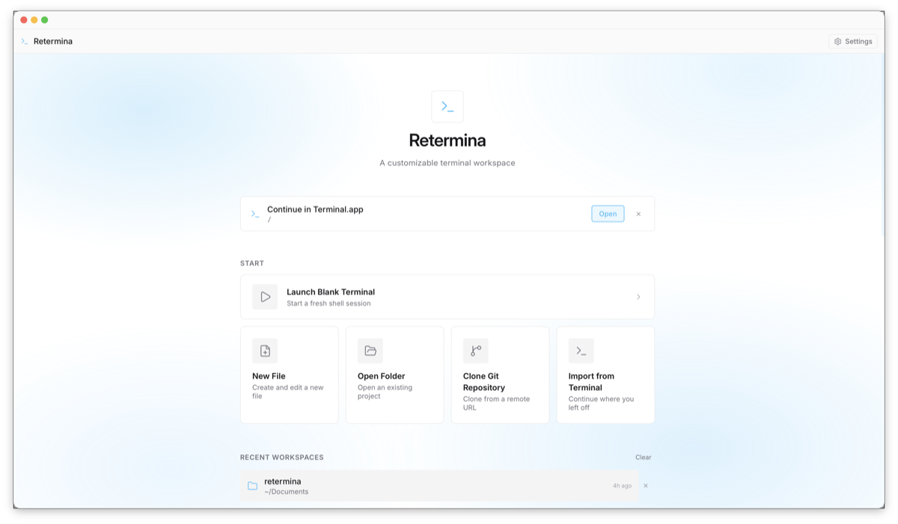

# Retermina

A customizable terminal workspace built on Tauri v2 and React. Retermina replaces the traditional terminal window with a modular, themeable desktop environment — real native shells, a file explorer and code viewer, live git diffs, a localhost tracker, a task runner, and a Claude Code panel — running securely inside a Rust PTY with no cloud dependency.



---

## Install (macOS)

Grab the latest `.dmg` from the [releases page](https://github.com/matthewhamilton3141/Retermina/releases/latest), drag Retermina to Applications, then run once in Terminal:

```sh
xattr -cr /Applications/Retermina.app
```

This clears the Gatekeeper quarantine flag on the unsigned build — macOS otherwise reports "Retermina is damaged and can't be opened," which isn't true.

---

## Features

**Panels & workspace** — Explorer, Terminal, Code, Localhost, Claude, Preview, Changes, and Tasks panels, freely dragged, resized, and arranged. Open several workspace tabs at once, each with its own folder, layout, and live terminals running in the background. Double-click a panel's header to focus-maximize it without unmounting anything underneath.

**Real terminals** — Native Zsh/Bash shells over a Rust PTY, streamed to xterm.js, with horizontal/vertical split panes, a broadcast-input toggle, scrollback search (⌘F), and clickable links.

**Sessions that survive restarts** — Terminals, dev servers, and long-running scripts run in a background session-host process, not the app itself, so quitting, crashing, or updating Retermina doesn't kill them. Reopen the app and they reattach with full scrollback intact, and the Agent view resumes the same Claude session with its whole conversation restored. (macOS only — Windows falls back to non-persistent PTYs.)

**Code panel** — Prism-based syntax highlighting with inline hex-colour swatches, a live diff mode, rendered Markdown preview, and a Safe Edit mode that keeps full highlighting while you type, with in-file find & replace.

**Changes panel** — A live git diff of the whole working tree, including edits Claude makes while running in the Terminal, with a commit composer and per-file discard.

**Claude integration** — A dedicated panel with two views that share one session: a chat-style Agent view (structured tool calls, diffs, and token-by-token streaming) and a raw CLI view. Switch views mid-conversation without losing context, change model or permission mode on the fly, and track token usage per project.

**Scheduled prompts** — Queue a prompt from the top-bar clock button to fire into a workspace's Claude panel at a chosen time — handy for timing work to when a usage limit resets, which Claude's own limit notices can prefill for you. Persists across reloads, so a queued prompt still fires even if you close the tab in the meantime.

**Search & navigation** — Cmd/Ctrl+P quick-open, Cmd/Ctrl+K command palette, and Cmd/Ctrl+Shift+F content search across the whole workspace.

**Theming** — Five structural engines (Sleek, Soft Pastel, Transparent Glass, Minimalist, Neo-Brutalism), each swapping corner radius, borders, shadows, blur, and fonts live. Any hex accent colour, with automatic contrast-aware text and selection colours.

**Loom presets** — Bundle theme, accent, fonts, backdrop, accessibility settings, and panel layout into one portable JSON file. Apply, export, import, or browse Looms shared by the community.

**Launch Hub** — Open Folder, New File, Clone Repo, and Import from Terminal (detects your external terminal's current directory), plus recent workspaces merged with your editor history and an "AI Line Edits" heatmap tracking Claude's contributions across projects.

**Session restore** — Reopens your last workspace, layout, and open file on launch, with per-folder layout snapshots so each project restores exactly as you left it — paths and layout only, never file contents or shell history.

---

## Architecture

- **Tauri v2 (Rust) backend** owns all privileged operations: PTY spawning, the session-host process, filesystem access, git status, Claude CLI/agent process management, font storage, and Loom preset persistence.
- **React + TypeScript frontend**, with **Zustand** for state management and persistence (mirrored to disk via Tauri commands, not just localStorage).
- **Tailwind CSS** for styling, layered under a semantic theming system (`--rt-*` custom properties) so components stay theme-agnostic.

---

## Getting Started

**Prerequisites:** Rust toolchain, Node.js ≥ 20, and the macOS build tools (`xcode-select --install`).

```bash
git clone https://github.com/matthewhamilton3141/retermina.git
cd retermina
npm install
npm run tauri dev    # development
npm run tauri build  # production bundle
npm test             # unit suite (Vitest)
```

> **Self-updates:** the distributed binary isn't Apple-signed, so the in-app auto-updater can't verify update integrity. The launch-time update check is silent and fails gracefully — to get updates, re-download from the [releases page](https://github.com/matthewhamilton3141/Retermina/releases).

---

## License

MIT — see [LICENSE](LICENSE) for details.
